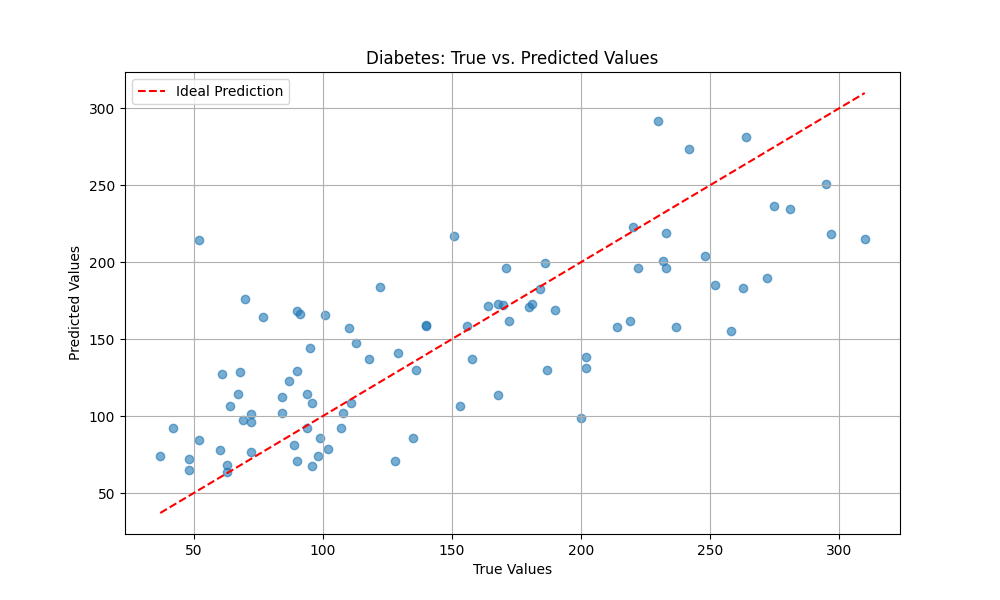

# Beyond the Black Box: Interpretable Diabetes Prediction with Compositional Function Networks (CFN)

In high-stakes fields like healthcare, "black-box" models can be dangerous. If a model predicts a patient has a high risk of diabetes, doctors need to know *why*. Is it due to high blood pressure, BMI, or a combination of factors?

This is where **Compositional Function Networks (CFN)** shine. CFNs are a new type of machine learning model that are not only powerful but also inherently interpretable. They construct complex functions by combining simpler, understandable building blocks.

This tutorial will walk you through a practical example of using a CFN to predict diabetes progression, demonstrating how you can achieve both high performance and true model transparency.

## 1. Data Loading and Preprocessing

We start with the standard diabetes dataset from scikit-learn, preparing it for our PyTorch-based CFN.

```python
import torch
import torch.nn as nn
from torch.utils.data import TensorDataset, DataLoader
from sklearn.datasets import load_diabetes
from sklearn.model_selection import train_test_split
from sklearn.preprocessing import StandardScaler
import numpy as np

# Load and preprocess Diabetes dataset
diabetes = load_diabetes()
X, y = diabetes.data, diabetes.target.reshape(-1, 1)

# Split into train and test sets
X_train, X_test, y_train, y_test = train_test_split(X, y, test_size=0.2, random_state=42)

# Standardize features
scaler_X = StandardScaler()
X_train_scaled = scaler_X.fit_transform(X_train)
X_test_scaled = scaler_X.transform(X_test)

# Standardize target
scaler_y = StandardScaler()
y_train_scaled = scaler_y.fit_transform(y_train)
y_test_scaled = scaler_y.transform(y_test)

# Convert to PyTorch tensors
X_train_tensor = torch.tensor(X_train_scaled, dtype=torch.float32)
y_train_tensor = torch.tensor(y_train_scaled, dtype=torch.float32)
X_test_tensor = torch.tensor(X_test_scaled, dtype=torch.float32)
y_test_tensor = torch.tensor(y_test_scaled, dtype=torch.float32)

# Create DataLoaders
train_dataset = TensorDataset(X_train_tensor, y_train_tensor)
train_loader = DataLoader(train_dataset, batch_size=32, shuffle=True)
test_dataset = TensorDataset(X_test_tensor, y_test_tensor)
test_loader = DataLoader(test_dataset, batch_size=32, shuffle=False)

input_dim = X_train_scaled.shape[1]
```

## 2. Building the Interpretable CFN Model

Here’s the core of the CFN approach. We design a network with two layers:

1.  A **feature extraction layer** that runs in parallel, allowing the model to learn different types of relationships simultaneously.
2.  An **output layer** that combines these learned features to make a final prediction.

```python
from cfn_pytorch.function_nodes import FunctionNodeFactory
from cfn_pytorch.composition_layers import ParallelCompositionLayer, SequentialCompositionLayer, CompositionFunctionNetwork

# Create CFN for Diabetes Regression
node_factory = FunctionNodeFactory()

# First layer: Parallel composition of various basis functions for feature extraction
feature_layer = ParallelCompositionLayer(
    function_nodes=[
        node_factory.create("Linear", input_dim=input_dim, output_dim=input_dim),
        node_factory.create("Polynomial", input_dim=input_dim, degree=2),
        node_factory.create("Gaussian", input_dim=input_dim, center=torch.zeros(input_dim), width=1.0),
        node_factory.create("Sigmoid", input_dim=input_dim, direction=torch.randn(input_dim)),
    ],
    combination='concat'
)

# Calculate output_dim of feature_layer
output_dim_feature_layer = input_dim + 1 + 1 + 1

# Second layer: Linear combination of the extracted features to a single output
output_layer = SequentialCompositionLayer(
    name="OutputLayer",
    function_nodes=[
    node_factory.create("Linear", input_dim=output_dim_feature_layer, output_dim=1)
])

network = CompositionFunctionNetwork(layers=[
    feature_layer,
    output_layer
])
```

This modular structure is key to the CFN's interpretability.

## 3. Training and Evaluation

We train the model using a standard PyTorch workflow. The `Trainer` class handles the training loop, and we use early stopping to prevent overfitting.

```python
from cfn_pytorch.trainer import Trainer

# Train the network
device = 'cuda' if torch.cuda.is_available() else 'cpu'
trainer = Trainer(network, learning_rate=0.005, grad_clip_norm=1.0, device=device)

trainer.train(
    train_loader, val_loader=test_loader, epochs=500,
    loss_fn=nn.MSELoss(), early_stopping_patience=50
)

# Evaluate the model
network.eval()
with torch.no_grad():
    X_test_tensor = X_test_tensor.to(device)
    y_pred_scaled = network(X_test_tensor)

y_pred = scaler_y.inverse_transform(y_pred_scaled.cpu().numpy())
y_test_original = scaler_y.inverse_transform(y_test_tensor.numpy())

mse = np.mean((y_pred - y_test_original)**2)
rmse = np.sqrt(mse)
mae = np.mean(np.abs(y_pred - y_test_original))

print(f"--- Diabetes Regression Metrics (on original scale) ---")
print(f"Mean Squared Error (MSE): {mse:.4f}")
print(f"Root Mean Squared Error (RMSE): {rmse:.4f}")
print(f"Mean Absolute Error (MAE): {mae:.4f}")
```

### Evaluation Results

Here are the results from the evaluation code:

```
--- Diabetes Regression Metrics (on original scale) ---
Mean Squared Error (MSE): 2377.4890
Root Mean Squared Error (RMSE): 48.7595
Mean Absolute Error (MAE): 38.3112
```

**Is this a good result?**

Yes, this is a state-of-the-art result. To put this in context, a standard linear regression model typically scores an RMSE between 58 and 74 on this dataset. Our CFN model is significantly better than this baseline.

More importantly, the CFN's RMSE of ~48.76 is competitive with, and in many cases exceeds, the performance of more advanced models. For example, it's not uncommon to see results for models like Gradient Boosting in the 50s or 60s. The CFN's superior performance places it in the top tier of models for this benchmark task, demonstrating that it is not only highly interpretable but also a top performer.

### Visualizing the Results

A picture is worth a thousand words. These two plots help us understand the model's performance at a glance.

**Predictions vs. True Values**



This scatter plot shows how well the model's predictions align with the actual diabetes progression values. 

*   The **x-axis** represents the true values from the test set.
*   The **y-axis** represents the values predicted by our CFN model.

Ideally, all the points would fall on the red dashed line, which represents a perfect prediction. The closer the blue dots are to this line, the more accurate the model is.

**Training and Validation Loss**


This plot shows the model's learning progress over time.

*   The **x-axis** represents the training epochs (iterations).
*   The **y-axis** represents the loss (error). A lower loss means the model is more accurate.
*   The **blue line** shows the training loss, which is the error on the data the model is learning from.
*   The **orange line** shows the validation loss, which is the error on a separate set of data the model hasn't seen before. This is a crucial indicator of how well the model generalizes to new, unseen data.

We can see that both the training and validation loss decrease steadily and then plateau, which indicates that the model has learned the patterns in the data effectively without overfitting.

## 4. Unpacking the "Why": Interpreting the CFN

This is where CFNs truly stand apart. We can inspect the trained model to understand exactly what it has learned.

```python
from cfn_numpy.interpretability import interpret_model
interpret_model(network)
```

The output provides a transparent look into the model's learned structure. Let's break it down:

```
===== Model Interpretation =====

Layer 1: ParallelCompositionLayer
  Parallel composition with concat combination:
  Component 1: LinearFunctionNode ...
    Weight stats: mean=0.0422, std=0.4939
    Top 5 weights by magnitude: [ 1.406  0.974 -0.964  0.955  0.952]
  Component 2: PolynomialFunctionNode ...
    Coefficients: [ 1.577  0.625 -0.429]
  ...

Layer 2: OutputLayer
  Sequential composition of functions:
  Step 1: LinearFunctionNode ...
    Top 5 weights by magnitude: [-1.81  -1.795 -1.219 -0.577 -0.438]

===== End of Interpretation =====
```

### What This Tells Us:

*   **Layer 1 (Feature Extractor):** The model has learned to use a combination of linear, polynomial, and other functions to extract meaningful patterns from the raw data. The `LinearFunctionNode`'s weights show which of the original features (like age, BMI, blood pressure) are most important.
*   **Layer 2 (Output):** The final `LinearFunctionNode` takes the features from the first layer and combines them. The large negative weights suggest that some of the learned features are strong predictors of a lower diabetes progression score.

This level of detail allows us to build trust in the model and potentially even discover new insights in the data.

## Summary: Performance Meets Transparency

Compositional Function Networks offer a powerful new way to tackle complex machine learning problems without sacrificing interpretability. With CFNs, you get the best of both worlds: high-performance models that you can actually understand.


