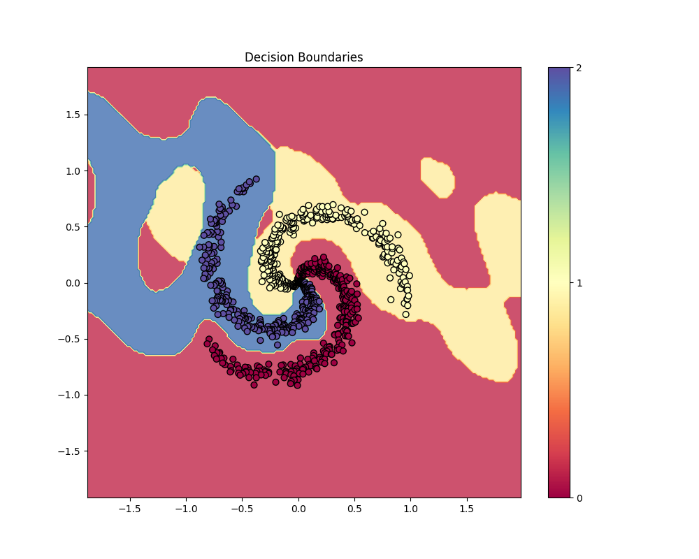
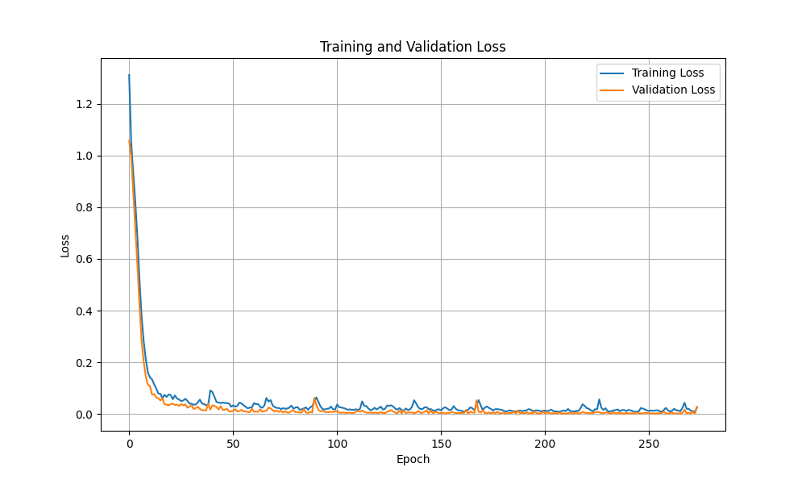

# Unraveling the Spiral: Interpretable Classification with CFNs

The "two spirals" problem is a classic benchmark designed to test a model's ability to learn highly non-linear decision boundaries. Many powerful models can solve it, but can they explain *how* they do it?

This is where **Compositional Function Networks (CFN)** come in. This tutorial will show you how a CFN can learn the intricate patterns of the spiral dataset while maintaining full interpretability, allowing us to understand the "why" behind its predictions.

## 1. Data Generation and Preparation

First, we generate the synthetic spiral dataset and prepare it for training by creating PyTorch DataLoaders.

```python
import torch
import torch.nn as nn
from torch.utils.data import TensorDataset, DataLoader
import numpy as np

def generate_spiral_data(n_samples_per_class=300, n_classes=3, noise=0.2):
    X = torch.zeros(n_samples_per_class * n_classes, 2)
    y = torch.zeros(n_samples_per_class * n_classes, dtype=torch.long) # Use long for CrossEntropyLoss
    
    for class_idx in range(n_classes):
        ix = torch.arange(n_samples_per_class * class_idx, n_samples_per_class * (class_idx + 1))
        r = torch.linspace(0.0, 1, n_samples_per_class)  # radius
        t = torch.linspace(class_idx * 4, (class_idx + 1) * 4, n_samples_per_class) + torch.randn(n_samples_per_class) * noise  # theta
        X[ix] = torch.stack([r * torch.sin(t), r * torch.cos(t)], dim=1)
        y[ix] = class_idx
    
    return X, y

# Generate spiral dataset
torch.manual_seed(42)
n_classes = 3
X, y = generate_spiral_data(n_samples_per_class=300, n_classes=n_classes, noise=0.2)

# Split into train and validation sets
indices = torch.randperm(X.shape[0])
split_idx = int(0.8 * X.shape[0])
train_indices, val_indices = indices[:split_idx], indices[split_idx:]

X_train, X_val = X[train_indices], X[val_indices]
y_train, y_val = y[train_indices], y[val_indices]

# Create DataLoaders
train_dataset = TensorDataset(X_train, y_train)
train_loader = DataLoader(train_dataset, batch_size=64, shuffle=True)
val_dataset = TensorDataset(X_val, y_val)
val_loader = DataLoader(val_dataset, batch_size=64, shuffle=False)
```

## 2. Building the Interpretable CFN Model

We construct a CFN with three layers:

1.  A **feature extraction layer** with a variety of function nodes (Gaussian, Sigmoid, Sinusoidal, Polynomial) to capture different aspects of the data.
2.  A **hidden layer** to learn complex interactions between the features.
3.  An **output layer** to make the final classification.

```python
from cfn_pytorch.function_nodes import FunctionNodeFactory
from cfn_pytorch.composition_layers import SequentialCompositionLayer, ParallelCompositionLayer, CompositionFunctionNetwork

# Create CFN for classification
node_factory = FunctionNodeFactory()

network = CompositionFunctionNetwork(
    name="ClassificationCFN",
    layers=[
    # First layer: Feature extraction
    ParallelCompositionLayer(
        name="FeatureExtractionLayer",
        function_nodes=[
            # Gaussian RBFs at different locations
            node_factory.create("Gaussian", input_dim=2, center=torch.tensor([0.3, 0.3]), width=0.3),
            node_factory.create("Gaussian", input_dim=2, center=torch.tensor([-0.3, 0.3]), width=0.3),
            node_factory.create("Gaussian", input_dim=2, center=torch.tensor([0.3, -0.3]), width=0.3),
            node_factory.create("Gaussian", input_dim=2, center=torch.tensor([-0.3, -0.3]), width=0.3),
            node_factory.create("Gaussian", input_dim=2, center=torch.tensor([0.0, 0.0]), width=0.5),
            
            # Sigmoid functions for directional splits
            node_factory.create("Sigmoid", input_dim=2, direction=torch.tensor([1.0, 0.0])),
            node_factory.create("Sigmoid", input_dim=2, direction=torch.tensor([0.0, 1.0])),
            node_factory.create("Sigmoid", input_dim=2, direction=torch.tensor([1.0, 1.0])),
            node_factory.create("Sigmoid", input_dim=2, direction=torch.tensor([1.0, -1.0])),
            
            # Sinusoidal functions for circular patterns
            node_factory.create("Sinusoidal", input_dim=2, frequency=3.0),
            node_factory.create("Sinusoidal", input_dim=2, frequency=5.0),
            
            # Distance from origin (useful for spiral)
            node_factory.create("Polynomial", input_dim=2, degree=2,
                                coefficients=torch.tensor([0.0, 0.0, 1.0])),
        ],
        combination='concat'
    ),
    
    # Second layer: Hidden layer
    SequentialCompositionLayer(
        name="HiddenLayer",
        function_nodes=[
        node_factory.create("Linear", input_dim=12, output_dim=8),
        node_factory.create("Sigmoid", input_dim=8)  # Element-wise sigmoid
    ]),
    
    # Third layer: Output layer (multiclass)
    SequentialCompositionLayer(
        name="OutputLayer",
        function_nodes=[
        node_factory.create("Linear", input_dim=8, output_dim=n_classes),
        # Softmax is implicitly handled by nn.CrossEntropyLoss
    ])
])
```

## 3. Training and Evaluation

We train the model using a standard PyTorch workflow.

```python
from cfn_pytorch.trainer import Trainer

# Train the network
trainer = Trainer(network, learning_rate=0.02)

trainer.train(
    train_loader, val_loader=val_loader, epochs=300, 
    loss_fn=nn.CrossEntropyLoss(), # For multi-class classification
    early_stopping_patience=30
)

# Evaluate accuracy
network.eval()
with torch.no_grad():
    y_pred_raw = network(X)
y_pred = torch.argmax(y_pred_raw, dim=1)
accuracy = (y_pred == y).float().mean().item()

print(f"\nClassification Accuracy: {accuracy:.4f}")

# Confusion matrix
conf_matrix = np.zeros((n_classes, n_classes), dtype=int)
for i in range(len(y)):
    conf_matrix[y[i].item(), y_pred[i].item()] += 1

print("Confusion Matrix:")
print(conf_matrix)
```

### Evaluation Results

Here is the output from our evaluation:

```
Classification Accuracy: 0.9967

Confusion Matrix:
[[300   0   0]
 [  2 298   0]
 [  1   0 299]]
```

An accuracy of **99.67%** is an exceptional result on this challenging dataset. The confusion matrix shows that the model makes very few errors, correctly classifying almost every point.

### Visualizing the Results

**Decision Boundaries**



This plot shows the decision boundaries that the CFN has learned. The different colored regions represent the areas where the model will classify a new data point as belonging to a particular class. The plot clearly shows that the CFN has learned the complex, non-linear spiral structure of the data.

**Training and Validation Loss**



This plot shows that the model learns quickly and effectively, with both the training and validation loss decreasing to a very low value.

## 4. Interpreting the Model

By inspecting the trained model, we can understand how it works.

```python
from cfn_numpy.interpretability import interpret_model
interpret_model(network)
```

The output provides a transparent look into the model's learned structure. Let's break it down:

```
===== Model Interpretation =====

Layer 1: FeatureExtractionLayer
  Parallel composition with concat combination:
  Component 1: GaussianFunctionNode ...
    Center: [0.733 0.753]
    Width: 0.1531
  Component 10: SinusoidalFunctionNode ...
    Frequency: 3.5364
    Amplitude: 2.6870
    Phase: 0.1111
    Direction: [1.288 1.351]
  ...

Layer 2: HiddenLayer
  Sequential composition of functions:
  Step 1: LinearFunctionNode ...
    Weight stats: mean=-0.0934, std=1.7995, min=-4.5798, max=4.4729
    Top 5 weights by magnitude: [-4.58   4.473 -4.059  3.875 -3.869]
  ...

Layer 3: OutputLayer
  Sequential composition of functions:
  Step 1: LinearFunctionNode ...
    Weight stats: mean=-0.2921, std=2.7190, min=-4.9509, max=4.2357
    Top 5 weights by magnitude: [-4.951 -4.904  4.236  4.052  3.541]

===== End of Interpretation =====
```

### What This Tells Us:

*   **Feature Extraction:** The `SinusoidalFunctionNode` is likely critical for capturing the rotational patterns in the data, while the `GaussianFunctionNode`s help to isolate specific regions of the spirals. The `Sigmoid` nodes create linear decision planes, and the `Polynomial` node helps distinguish points based on their distance from the center.
*   **Hidden Layer:** This layer combines the features from the first layer to form a more abstract representation of the data, allowing for more complex decision-making.
*   **Output Layer:** The final layer uses the learned features to make a confident prediction.

## Summary

The CFN not only achieves near-perfect accuracy on the spiral dataset but also provides a fully interpretable model. This combination of performance and transparency is what makes CFNs a powerful tool for a wide range of machine learning problems.

